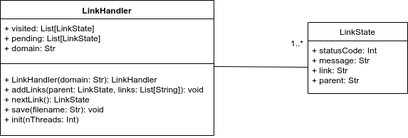

### Perl6::LinkHealth tool

I have been thinking a little about how to create this tool and I have come up with this:

(this is only to get the links, about the rest of the module will be made later)

First we get all existing links in one array and save them in a file,
after that, we can process and sort that info with another utilities.

The process would be something like this:

1. A `LinkHandler` object is created with `docs.perl6.org` as `domain`.
2. `init` method is called with the numbers of threads we want to use (16 by default).
3. The first link in `pending` will be "/". It will be scraped by the first process and the result will be added 
calling the `addLink` method (the first arg, `parent`, will contain the info about the link scraped) and `links` 
will contain the links found in the page (they will be added to `pending`).
4. This process will be finished when all links in `pending` have been processed.
5. Save this file in CSV format (or JSON)

The next step would be create one script to process the previous generated file and classify the links (as described
[here](https://github.com/antoniogamiz/perl6-gsoc-application#link-scraper) and get some moreuseful info about them.

This is my first approach, so any feedback, improvement or suggestion is welcomed (if you think this is totally 
incorrect just tell me).
